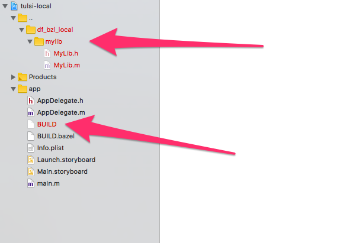

# tulsi-local-repo

Illustrates a problem generating tulsi projects with code that lives in `local_repository`.

`bazel build //app:HelloWorld` works fine, building the application and its dependency (`@df_bzl_local//:my_objc_lib`)

When generating a tulsi project, the files for the dependency are listed relative to the main workspace root instead of the workspace root of the `local_repository`, so they are "missing" in Xcode.

